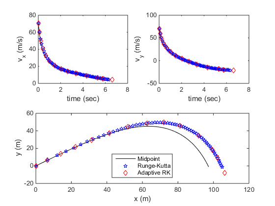

# hw_orbits
Homework for Garcia Ch. 3, orbital motion

## Contents

  
*   [Problem 1 (in class)](#2)
*   [Problem 2 (homework)](#3)

## Problem 1 (in class)

Modify the program <tt>projectile.m</tt> and the associated function <tt>derivsProj.m</tt> so that it includes the option to use the Runge-Kutta (<tt>rk4.m</tt>) and adaptive Runge-Kutta (<tt>rka.m</tt>) solvers. Your program is working if it produces the following outputs for the three methods (hit "Run" multiple times and add a legend in the command window).

What conclusions can you make about the different solvers based on your results? Use the <tt>disp()</tt> function to have your program print your answer in the command window.

## Problem 2 (homework)

(From <it>Garcia</it>, #25 page 90) One characteristic of chaotic dynamics is sensitivity to initial conditions. Using <tt>rk4.m</tt>, write a non-adaptive version of the Lorenz program (<tt>lorenz.m</tt> and <tt>lorzrk.m</tt>) that simultaneously computes the trajectories for two different sets of initial conditions.
 * Use initial conditions that are very close together (ex: <tt>[1 1 20.000]</tt> and <tt>[1 1 20.001]</tt>)
 * Carry out the computation for 3000 steps with a time step of 0.005 seconds
 * Use parameter values of sigma = 10, b = 8/3, and r = 28
 * Plot the distance between these trajectories as a function of time
 
How does the distance vary with time? How does this relate to chaotic dynamics? Use the <tt>disp</tt> function to have your program print your answer in the command window.
